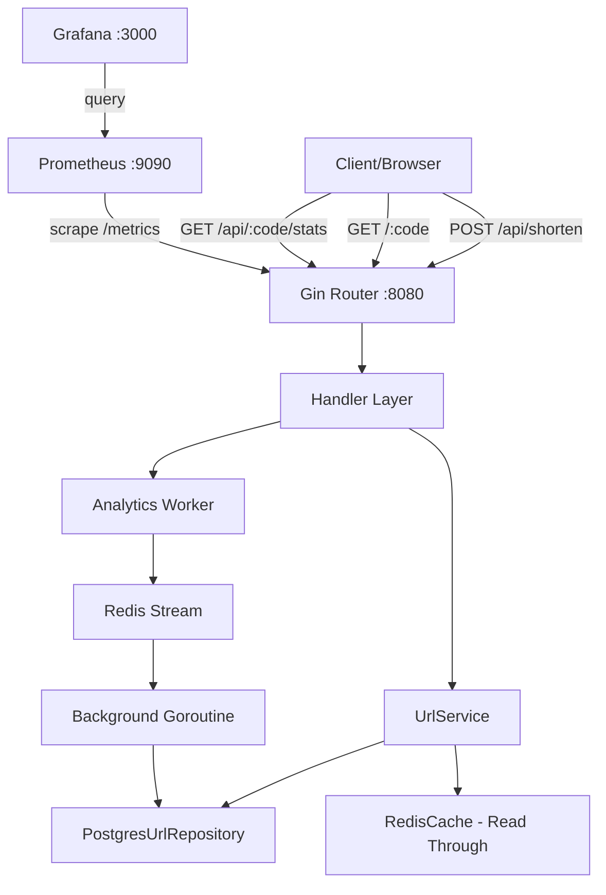

# go-url-shortener

A production-ready URL shortener built with Go, Gin, Postgres, and Redis.

Demonstrates **system design, caching strategies, background workers, observability, and containerized deployment**.

---

## Architecture



## API

| Method | Path | Description |
|--------|------|-------------|
| POST | `/api/shorten` | Create short URL |
| GET | `/:code` | 301 Redirect to long URL |
| GET | `/api/:code` | Get URL metadata |
| GET | `/api/:code/stats` | Get click statistics |
| GET | `/health` | Health check |
| GET | `/metrics` | Prometheus metrics |
| GET | `/docs` | Swagger UI |

### Create Short URL

```bash
curl -X POST http://localhost:8080/api/shorten \
  -H "Content-Type: application/json" \
  -d '{"long_url": "https://example.com/very/long/path"}'
```

**Response:**
```json
{
  "short_code": "aB3x9Z",
  "short_url": "http://localhost:8080/aB3x9Z",
  "expires_at": "2024-01-15T10:00:00Z"
}
```

### Custom Alias

```bash
curl -X POST http://localhost:8080/api/shorten \
  -H "Content-Type: application/json" \
  -d '{"long_url": "https://example.com/resume", "alias": "my-resume", "expires_in_hours": 48}'
```

## Getting Started

### Prerequisites

- Docker & Docker Compose

### One Command Setup

```bash
docker compose up
```

This starts all services:

| Service | Port | Purpose |
|---------|------|---------|
| App | 8080 | URL shortener API |
| Postgres | 5432 | Primary datastore |
| Redis | 6379 | Read-through cache + stream |
| Prometheus | 9090 | Metrics collection |
| Grafana | 3000 | Metrics dashboard |

### Grafana Dashboard

1. Open http://localhost:3000
2. Login: `admin` / `admin`
3. Navigate to the "URL Shortener" dashboard
4. Key panels: Request Rate, Error Rate, Latency (p50/p99), Cache Hit Ratio

## Development

```bash
# Run tests
make test

# Run tests with verbose output
make test-verbose

# Build binary
make build

# Run linter
make lint

# Regenerate swagger docs
make swagger

# View app logs
make docker-logs

# Tear down everything
make docker-clean
```

## Design Decisions

| Decision | Rationale |
|----------|-----------|
| Random 6-char code + retry | No sequence leaks, distributed-friendly, DB unique index prevents collisions |
| Postgres over SQLite/Mongo | ACID compliance, unique index enforcement, concurrent write support |
| Redis read-through cache | <1ms p99 on cache hit, 24h TTL for bounded memory |
| Redis Stream for analytics | Write-behind pattern keeps redirect path fast, survives restarts |
| In-process goroutine worker | Simple deployment (single binary), combined click aggregation + expiry cleanup |

See `docs/adr/` for detailed decision records.

## Load Testing

```bash
# Test POST /api/shorten (200 concurrent, 2min)
make k6-up

# Test GET /:code (2000 concurrent, 2min)
make k6-redirect
```

Expected baseline results:

| Endpoint | Without Cache | With Cache |
|----------|--------------|------------|
| POST /api/shorten | ~2k RPS | N/A |
| GET /:code | ~3k RPS | ~15k RPS |

## Tech Stack

- **Language:** Go 1.26
- **Framework:** Gin
- **Database:** PostgreSQL 16 (with GORM)
- **Cache:** Redis 8 (read-through + streams)
- **Observability:** Prometheus + Grafana
- **Containerization:** Docker Compose
- **CI:** GitHub Actions (lint, test, build)
- **API Docs:** Swagger / OpenAPI

## Project Structure

```
├── cmd/api/              # Entry point
├── internal/
│   ├── cache/            # Redis read-through cache
│   ├── config/           # Environment configuration
│   ├── domain/           # GORM domain models
│   ├── handler/          # HTTP handlers
│   ├── middleware/       # Observability, rate limiting
│   ├── repository/       # Postgres data access layer
│   ├── service/          # Business logic
│   └── shortener/        # Short code generator
├── pkg/
│   ├── analytics/        # Background worker (Redis Stream consumer)
│   └── validator/        # URL and alias validation
├── docker/               # Prometheus + Grafana config
└── k6/                   # Load test scripts
```
